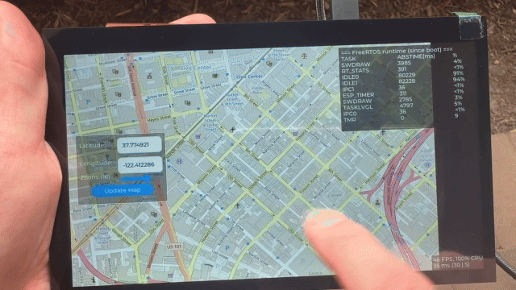

# v1 — Map display

Projects built on the original `map_tiles.h` API: a fixed grid of tile widgets
anchored to an integer tile coordinate, panned by hand, with markers placed on
top. This is the right shape for a map you look at — a viewer, a tracker, a
position plotted on a screen.

These projects are **unchanged** and still build against `0015/map_tiles`
v2.0.0. v2 added a second rendering path alongside this one; it removed nothing.
If the map has to keep up with something that is moving, see [`../v2`](../v2)
instead, and [v1 and v2](../README.md#v1-and-v2) for the comparison.

## Projects

### [01.Simple_Map](01.Simple_Map)

Interactive map display with touch controls, real-time GPS coordinate tracking,
zoom and manual coordinate entry, across three ESP32 boards with different
displays:

| Folder | Board |
|---|---|
| `espressif_esp32_p4_function_ev_board/` | Espressif ESP32-P4 Function EV Board |
| `waveshare_esp32_p4_wifi6_touch_lcd_xc/` | Waveshare ESP32-P4-WIFI6-Touch-LCD-XC |
| `waveshare_esp32_s3_touch_amoled_1_75/` | Waveshare ESP32-S3-Touch-AMOLED-1.75 |
| `shared_components/` | the map viewer shared by all three |

**[Watch demo →](https://youtu.be/Kyjf24e-Poo)**

### [02.ESP32-S3_Map_LoRa_GPS](02.ESP32-S3_Map_LoRa_GPS)

Map display joined to LoRa wireless communication and live GPS tracking on
ESP32-S3: two devices exchange positions over long range and plot each other on
a local map.

**[Watch demo →](https://youtu.be/KDNXQfUJcSY)**

## Tiles

Both projects read 256×256 RGB565 tiles with a 12-byte LVGL v9 header from an SD
card, laid out as `<folder>/<zoom>/<x>/<y>.bin`. Build a card with
[OfflineMapDownloader](https://github.com/0015/OfflineMapDownloader) — select a
rectangle, download, then convert the PNGs with `lvgl_map_tile_converter.py`
from the [map_tiles](https://github.com/0015/map_tiles) repository.

(v2's packager writes RGB565 directly and skips that conversion step, but it
downloads a corridor around a route rather than a rectangle, so it is not a
drop-in replacement for these projects.)
