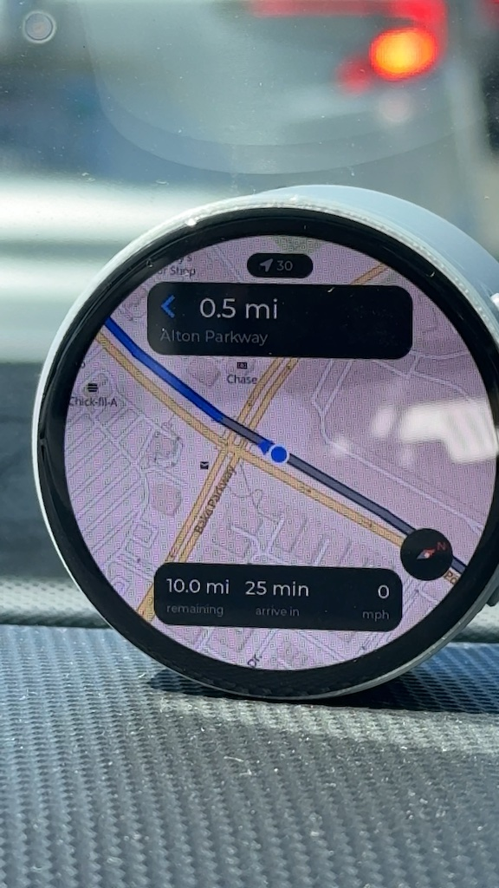

# v2 · 01 — Navigation on ESP32-S3, 1.75 inch round AMOLED

Offline turn-by-turn navigation on a watch-sized board that runs off a battery:
a route drawn on the map, a marker that follows you along it, the next turn,
distance and ETA — with no network, no cloud and no API key. Everything comes
off the SD card.

<div align="center">

| | |
|---|---|
| **Board** | Waveshare ESP32-S3-Touch-AMOLED-1.75 |
| **Display** | 466×466 round AMOLED (SH8601, QSPI), CST9217 touch |
| **Power** | AXP2101 PMU — battery percentage and charge state on screen |
| **Compass** | the board's QMI8658 IMU — north set by the GPS course, carried by the gyroscope |
| **GPS** | Quectel LC76G on UART2 (a route simulator is built in for desk testing) |
| **Component** | `0015/map_tiles` **v2.0.0** or later |
| **Verified on** | ESP-IDF 5.5.4 |

</div>

<!-- SCREENSHOT: ../misc/nav_s3_screen.jpg — this board mid-route, showing the
     battery pill and the tighter 466x466 layout. -->

Read the [v2 navigation README](../README.md) first: the SD card layout, the
route packager, drive versus exercise mode, and what happens when you leave the
route are all described there and are the same here. This file covers only what
is specific to this board.

## Build and flash

```bash
idf.py set-target esp32s3
idf.py build
idf.py -p /dev/ttyUSB0 flash monitor
```

If you move or rename the project folder, run `idf.py fullclean` first. The
build directory records the absolute path it was configured for, and every
later `idf.py build` and `idf.py flash` refuses outright:

```
Build directory '.../build' configured for project '<old path>' not
'<new path>'. Run 'idf.py fullclean' to start again.
```

`flash` runs the build first, so it stops there too — leaving whatever was
already on the board running, which looks exactly like a change that did
nothing.

The card holds the tiles, and the routes if there are any:

```
/sdcard/
  routes/<name>.bin        one or more routes (optional)
  tiles1/<z>/<x>/<y>.bin   256×256 RGB565 tiles
```

With no routes, the tiles open as a map on its own; the
[v2 README](../README.md#a-map-on-its-own) has the details.

## What is board-specific

The guidance engine, the position source and the route loader are plain C over
`map_tiles` and know nothing about this board. Everything in this table is what
had to be decided for it, and all of it lives in `main.c`, `nav_ui.c` and
`nav_config.h`:

| | |
|---|---|
| Panel | 466×466 QSPI AMOLED, brought up without the BSP's RGB path |
| Rotation | software only on this chip, so it stays at 0 |
| Brightness | panel command 0x51; there is no backlight pin |
| Touch | CST9217 read directly, in a task, with a deadline on every transfer |
| GPS | LC76G on UART2, GPIO 17/18 |
| Compass | on-board QMI8658 gyroscope, north taken from the GPS course |
| Battery | AXP2101, shown in the status pill |
| Tile cache | 28 slots, 3.5 MB of the 8 MB PSRAM |
| Controls | hidden until you tap the map — at this size they would cover it |

### The screen

<div align="center">



</div>

The panel is a circle of radius 233, and the chord runs out fast: 401 px of
usable width 119 px from the centre, 293 px at 181, 189 px at 213. Every panel
is sized against the chord at whichever of its edges is nearest the rim —
`nav_chord_half()` in `nav_theme.h` is that arithmetic, and `fit_width()` in
`nav_ui.c` applies it, so a panel that is edited too wide narrows instead of
having its corners eaten by the bezel.

That leaves 222 px of map between the banner and the summary. Three things were
done to spend it well:

* **The controls hide.** Four 56 px buttons — the smallest comfortable thumb
  target on glass this size — would cover a third of the map if they stayed up.
  Tap anywhere on the map and they appear for six seconds. The tap is told from
  a pan by summing the finger's travel, the same test `map_view` uses to decide
  it is being dragged, so a drag that ends where it started is still a drag.
* **Re-centring is the exception.** Once a drag has released follow mode, the
  re-centre button stays up on its own until it is used. It is the only way
  back, and a hidden control cannot tell you it is there.
* **The unit moved into the caption.** A third of the summary panel is 82 px,
  which "45 km/h" at 20 px does not fit. The number gets the space and `km/h`
  goes in the caption slot under it, where the column headings live anyway.

Every font is a size down from what a larger panel would carry, except the one
that matters — the distance to the next turn, at 28 px.

### Battery

`nav_power.cpp` wraps the vendor's `pmu_axp2101` class in a C API and
polls it from a low-priority task every ten seconds, so the I2C traffic never
lands in the draw path. The reading appears in the status pill: a battery
symbol and a percentage, a charge bolt when it is charging, and red below
`NAV_BATTERY_LOW_PCT`. A board with no cell in it shows nothing there and
navigates normally.

### Compass

The board's QMI8658 drives a compass dial. It sits at half past four on the
map, clear of the buttons and panels. The red half of the needle points at true
north relative to the top of the screen. Tap the dial and it shows the heading
in degrees for five seconds instead.

The QMI8658 has no magnetometer, only an accelerometer and a gyroscope, so it
can measure how far the device turns but never which way it faced to begin
with. Here the GPS supplies that. While you travel in a straight line at
`NAV_COMPASS_ALIGN_MIN_SPEED_MPS` (2 m/s) or more, the course over ground is
the way the device faces, and it sets the heading. The gyroscope carries the
heading from there: through a stop at a light, a U-turn, the bike being
wheeled round. Every straight stretch sets it again.

In practice:

* **No dial until you have moved.** At power-on nothing says where north is,
  so the dial stays hidden rather than point somewhere made up. It appears a
  few seconds into the first straight.
* **It fades if it goes too long without GPS.** The firmware estimates how far
  the heading may have drifted since the GPS last set it. The estimate grows
  while the device turns or is carried about, and not at all while it sits
  still. Past `NAV_COMPASS_TRUST_DEG` (15°) the dial gets an amber ring and a
  faded needle, and its readout shows the possible error, such as `±23°`, in
  place of the direction. Past `NAV_COMPASS_GIVE_UP_DEG` (90°) it hides until
  the next straight.
* **Nothing magnetic to go wrong.** A car's body and electrics cannot bend it,
  there is no figure-of-eight calibration, and there is no declination to look
  up: the GPS course is already relative to true north.

The gyroscope's zero-rate offset is measured whenever the board has been still
for a second, on a desk or on its mount at a light. While it is still the
heading is held outright, so a parked unit does not drift. The offset is saved
to NVS and restored at the next power-on, so a board that boots on the move
does not start from nothing.

One setting needs to match your mounting, in
[`main/nav_config.h`](main/nav_config.h): `NAV_COMPASS_MOUNT_OFFSET_DEG`, where
the top of the screen points relative to the direction of travel. It is 0 for
a unit on the handlebars or the dash with the top of the screen facing forward.
How the chip sits on the board does not matter. The turn rate is measured about
gravity, whichever way up the board is, so there is no axis mapping to set.

The log reports each change of state:

```
I compass: Gyroscope bias restored. The dial appears once a GPS course at 2.0 m/s or more has set north
I compass: North set from the GPS course: heading 87 at 4.2 m/s
I compass: Heading uncertain, may be 16 deg off; the dial fades until a GPS course sets it again
I compass: Heading set again from the GPS course
```

**The marker when you stop.** Below `NAV_HEADING_MIN_SPEED_MPS` the marker and
the "route is to your left" hint use the compass heading in place of the last
GPS course, unless the dial is faded. That heading is the last course plus
whatever the gyroscope has seen since, so turning the bike round at a light
turns the marker with it. The handover is logged:

```
I nav_engine: Heading from the compass (stopped)
I nav_engine: Heading from the GPS course
```

The IMU shares the BSP's I2C bus (GPIO 15/14) with the touch controller and the
PMU, and is read at 50 Hz from a task of its own. `qmi8658.c` talks to it with
the ordinary I2C master API rather than through the vendor demo's SensorLib,
which uses the legacy I2C driver that ESP-IDF 5 will not run alongside the new
one.

### GPS wiring

```c
#define NAV_GPS_UART_NUM            UART_NUM_2
#define NAV_GPS_UART_TX_PIN         17      /* ESP32-S3 -> module RX */
#define NAV_GPS_UART_RX_PIN         18      /* ESP32-S3 <- module TX */
#define NAV_GPS_UART_BAUD           115200  /* LC76G default */
```

The ESP32-S3 has three UARTs, and almost every pin on this board is spoken
for: 14/15 are I2C, 8–10 and 42/45/46 are I2S, 4–7, 12 and
38/39 are the panel, 40 is the touch reset, 1–3 are the SD card, and octal PSRAM
takes 33–37. GPIO 17 and 18 are what is left, and are what the vendor demo used.

`nav_config.h` ships with `NAV_GPS_SOURCE_LC76G` selected. Swap the two lines
above it for `NAV_GPS_SOURCE_SIMULATOR` to drive the whole app along a route
from your desk, with the transport bar for pausing, skipping to the next turn
and walking deliberately off the road.

### What the BSP gets wrong, and what this project does instead

Two parts of the vendor stack needed working around before this board would
run a map reliably: the display path and the touch stack. Both are handled in
`main.c`. The display has a switch in `nav_config.h` to go back to the vendor
path and see for yourself; the touch stack does not, for the reason below.

**The panel is driven as if it were an RGB one.**
`bsp_display_start_with_config()` hands this QSPI panel to
`lvgl_port_add_disp_rgb()`, the entry point for panels on the S3's RGB LCD
peripheral. Two things follow. The port marks the display RGB, so its flush
calls `lv_disp_flush_ready()` as soon as `esp_lcd_panel_draw_bitmap()` returns
— while the DMA is still reading the buffer LVGL is now free to draw into. And
it registers an RGB vsync callback on the handle:

```c
esp_lcd_rgb_panel_register_event_callbacks(panel_handle, &vsync_cbs, ctx);
```

which takes what it is given to be an `esp_rgb_panel_t` and writes the
callbacks a few hundred bytes along — past the end of the small SH8601 panel
that was actually allocated, into whatever the heap put next to it. Nothing
type-checks it. A stray write like that does not announce itself; it comes back
later as a hang with an empty log, somewhere unrelated.

So `display_start()` builds the panel with the BSP's own `bsp_display_new()` —
which resets, initialises and powers it on, and keeps the handles the
brightness control needs — and gives it to `lvgl_port_add_disp()`, what every
other SPI panel uses. The flush then waits for the transfer, because the port
takes completion from the panel IO's own callback. `NAV_BSP_DISPLAY_START 1`
restores the vendor path.

**The touch stack cannot be made safe, so it is not used.** Three faults stack
up in it. `esp_lvgl_port`'s pointer device is
`ESP_ERROR_CHECK(esp_lcd_touch_read_data(...))`, so one malformed frame reboots
the device. The CST9217 driver reads the chip id at start-up by entering the
controller's command mode (register `0xD101`) and never leaves it, and a frame
read in that mode carries no `0xAB` marker at `frame[6]` — so the first read
after the screen goes live is exactly such a frame. And `esp_lcd`'s I2C
transport passes `-1` as its transaction timeout, which means *wait forever*.

That last one is the fatal one, because the vendor stack makes the call from
inside the LVGL thread. When the bus wedges, the user interface goes with it —
no panic, no watchdog, nothing in the log, because the task is blocked rather
than spinning. Moving the read into a task of its own kept the map running long
enough for the UI to say what had happened:

```
W (89422) nav: Touch poller has not reported for 3000 ms - the bus is stuck.
               Navigation carries on without touch.
```

So `main.c` reads the controller itself, over the ordinary I2C master API. The
register, the ten-byte frame and the coordinate arithmetic are the vendor
driver's, unchanged; what is different is that every transfer carries
`NAV_TOUCH_I2C_TIMEOUT_MS`, so a stuck bus returns an error rather than
swallowing its caller — and that nothing ever puts the chip into command mode
in the first place. The poller owns the chip, LVGL copies its last point out of
memory, and a run of `NAV_TOUCH_STUCK_READS` failures earns a reset pulse and
an `i2c_master_bus_reset()`, at most every `NAV_TOUCH_RECOVER_MS`.

Nothing is left of `esp_lcd_touch`, `esp_lcd_touch_cst9217` or the port's input
device on this path. That is three layers replaced by about eighty lines, which
is a poor trade in the ordinary case and the right one here: each of those
layers had a fault, and the bottom one could not be worked around from above.

### When it freezes and says nothing

`NAV_HEARTBEAT_S` puts one line in the log every ten seconds, from a task that
is not the LVGL thread, reporting whether the LVGL thread has moved since the
last one:

```
I nav: alive: LVGL running, 1423 fixes, heap 198 KB internal / 4102 KB PSRAM
```

`LVGL STUCK` with the line still coming means the UI thread is blocked and
everything else is fine — the touch bus and the flush path are where to look.
The line stopping altogether means something took the whole device. Set it to 0
when you no longer want it.

### Performance

The ESP32-S3 has no PPA and no second core to spare, and it draws this map in
software, so three settings in `sdkconfig.defaults` matter more than they
usually would:

* `CONFIG_SPIRAM_SPEED_80M` — every frame copies up to 3×3 tiles out of PSRAM
  into the draw buffer. The IDF default of 40 MHz halves the bandwidth that
  costs. If your board is not stable at 80 MHz, this is the first thing to put
  back.
* `CONFIG_ESP32S3_DATA_CACHE_64KB` with 64-byte lines — the tile blit is a long
  sequential read, which is exactly what a bigger cache line is for.
* `NAV_TILE_CACHE_SLOTS` at 28. The view needs 9 tiles and `map_view` only warms
  the ring around them when the cache can hold all 25, so dropping below 25
  quietly turns prefetching off and you feel it when panning.

`CONFIG_FATFS_LFN_HEAP` is on. Without long filenames
FatFs sees only 8.3 names, and a tile folder called `tiles_tahoe` — which is
what the packager writes when you name it that — cannot be opened at all: the
map comes up blank with nothing in the log that points at the cause.

The build is about 820 KB. The default single-app table leaves an app 1 MB,
which is close enough to be a nuisance the first time you add a font, so
`partitions.csv` gives it 6 MB of the 16 MB flash instead.

## Layout of the code

| File | Role | Board-specific |
|---|---|---|
| `main.c` | board bring-up, and the one timer that moves fixes onto the LVGL thread | yes |
| `nav_config.h` | every tunable: pins, zooms, thresholds, GPS source, fonts | yes |
| `nav_theme.h` | palette, panel style, and the circle's chord arithmetic | yes |
| `nav_ui.c` | the round-display screen | yes |
| `nav_power.cpp` | battery and charger state over the AXP2101 | yes |
| `pmu_axp2101.cpp` | the vendor's XPowersLib wrapper, kept as-is | yes |
| `qmi8658.c` | a minimal QMI8658 driver on the I2C master API | yes |
| `compass_source.c` | the heading: gyroscope-tracked, north set by the GPS course | the IMU behind it |
| `nav_routes.c` | the route scanner and picker | the picker's geometry |
| `nav_maps.c` | the tile-folder scanner, for maps with no route | **no** |
| `gps_lc76g.c` | the NMEA driver | only the default pins |
| `nav_engine.c` | guidance state machine: matching, off-route hysteresis, cues | **no — plain C, no LVGL** |
| `gps_source.c` | one position feed, backed by the LC76G or the simulator | **no** |

The division that matters: `nav_engine.c` has no LVGL in it and `nav_ui.c` has
no guidance logic. Retargeting this to another panel is a screen and a bring-up
file, not a fork.

## Known limits

Everything in the [main README's list](../README.md#known-limits) applies here
too — north-up only, no on-device re-routing, Latin street names unless you add
a font, no voice. Three more are specific to this board:

* **Rotation costs CPU.** The display is registered with LVGL's `sw_rotate`,
  there being no PPA on this chip, so any `NAV_DISPLAY_ROTATION` other than 0
  adds a full pass over 466×466 pixels per frame. The panel comes up the right way round in the stock housing.
* **The compass has to move to find north.** There is no magnetometer on the
  board, so the dial waits for the GPS course and fades if it goes too long
  without one. See [Compass](#compass).
* **No pinch zoom.** The CST9217 does report more than one contact, but LVGL
  feeds a pointer device a single point and `map_view` has no gesture handling,
  so zooming is the two buttons.
