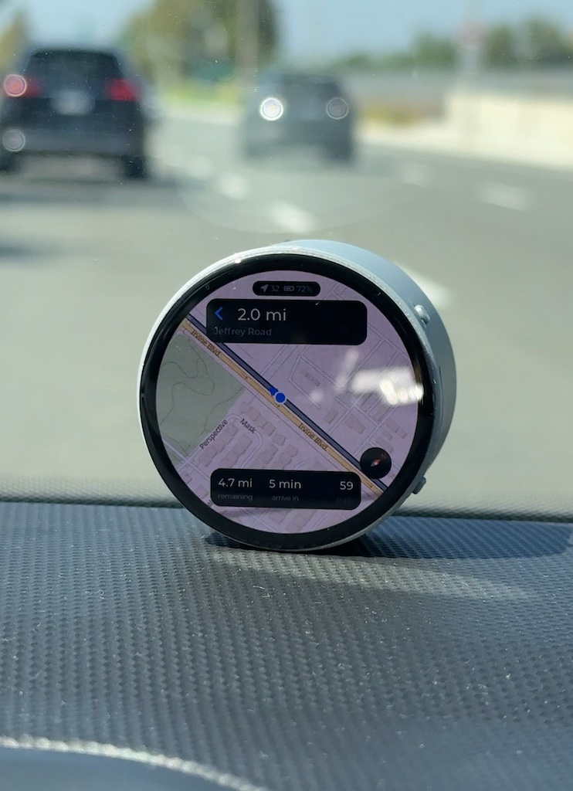

# v2 — Offline Navigation

Offline turn-by-turn navigation: a route drawn on the map, a marker that follows
you along it, turn instructions, distance and ETA — with no network, no cloud
and no API key. Everything comes off the SD card.

This is the **v2** generation of the examples, built on the navigation layer
added in `0015/map_tiles` **v2.0.0**. The [v1 projects](../v1) are unchanged and
still build; see [v1 and v2](../README.md#v1-and-v2) for which one you want.

<div align="center">



</div>

<div align="center">

| | [01 · ESP32-S3-Touch-AMOLED-1.75](01.Navigation_ESP32-S3-Touch-AMOLED-1.75) |
|---|---|
| **Display** | 466×466 round, 1.75 inch, QSPI AMOLED |
| **GPS** | Quectel LC76G on UART2 |
| **Power** | battery, with the charge shown on screen |
| **Compass** | on-board QMI8658 gyroscope |
| **Controls** | hidden until you tap the map |
| **README** | [01/README.md](01.Navigation_ESP32-S3-Touch-AMOLED-1.75/README.md) |

</div>

A route simulator is built in for desk testing, and the project needs
`0015/map_tiles` **v2.0.0** or later.

Everything below is the application, which is board-independent: the guidance
engine, the route loader and the position source are plain C over `map_tiles`.
What belongs to the board — the panel, the pins, the layout — is in
[the project's own README](01.Navigation_ESP32-S3-Touch-AMOLED-1.75/README.md).

## What is different from v1

The v1 examples anchor a fixed grid of tile widgets to an integer tile
coordinate. That works when you drag the map yourself, and falls apart when the
map has to keep up with a moving vehicle: crossing a tile boundary reloads the
whole grid from the SD card, on the UI thread, behind a modal.
[`v1/02.ESP32-S3_Map_LoRa_GPS`](../v1/02.ESP32-S3_Map_LoRa_GPS) even disables
auto-recentring for that reason.

`map_tiles` v2.0.0 adds a different rendering path, and these examples are built
on it:

| | v1 examples | v2 examples |
|---|---|---|
| View centre | integer tile index | continuous world-pixel coordinate |
| Panning | 256 px jumps at grid edges | smooth, with fling momentum |
| Tile loading | whole grid, synchronous, blocking | per tile, LRU cached, background task |
| Widgets | one `lv_image` per tile (25) | one `map_view` that draws everything |
| Follow the vehicle | not usable | eased, the map moving under the marker |
| Position | a marker you place | a GPS fix snapped onto the route |
| Route | — | polyline with per-zoom level of detail, turns, ETA |
| Off route | — | detected, with the distance and direction back |

## What you need

1. **An SD card** (FAT32) holding tiles, and a route if you want one to follow:

   ```
   /sdcard/
     tiles1/<zoom>/<x>/<y>.bin     256×256 RGB565, 12-byte LVGL v9 header
     routes/<name>.bin             geometry + turns, format "MRT1"
   ```

   A card with tiles and no route opens as a map on its own — see
   [A map on its own](#a-map-on-its-own).

2. **Both files from one zip.** Run the navigation packager in
   [OfflineMapDownloader](https://github.com/0015/OfflineMapDownloader):

   ```bash
   pip install -r requirements_nav.txt
   python app_nav.py          # http://127.0.0.1:5001
   ```

   Click waypoints, **Plan route**, pick zoom levels, **Build SD package**.
   You get one zip to unpack onto the card root — tiles already converted, plus
   the route in `routes/`. It only downloads a corridor around the route: a
   20 km drive at z16–17 is about 760 tiles, where its bounding box would be
   about 4,100.

   Already have a GPX? `python route_format.py --gpx ride.gpx --out route.bin`.

   Just want the map? Switch the packager to **Area · tiles only**, click two
   corners of a rectangle and build: the same card, with no route in it.

## Build and flash

```bash
cd 01.Navigation_ESP32-S3-Touch-AMOLED-1.75
idf.py set-target esp32s3
idf.py build
idf.py -p /dev/ttyUSB0 flash monitor
```

Moved or renamed the project folder? Run `idf.py fullclean` first. The build
directory records the absolute path it was configured for, and `idf.py build`
and `idf.py flash` both refuse outright until it is cleared — which looks
exactly like a flash that did nothing.

### Board-specific setup

Screen rotation, the BSP pins, the tile-cache size and the driver workarounds
this board needed are in
[the project's README](01.Navigation_ESP32-S3-Touch-AMOLED-1.75/README.md):
the AMOLED panel, the AXP2101 battery readout, the QMI8658 compass and the
tighter layout.

## Zoom levels and what is on the card

This is the one thing most likely to leave you looking at a blank map, so it is
worth understanding before anything else.

The packager downloads a **corridor** around the route at the **zoom levels you
picked** — nothing else. The device asking for any other zoom is not an error
anywhere in the stack: the cache reports a miss, the view draws a placeholder,
and you get an empty grid that looks like a bug rather than a missing download.

So at start-up the app probes `/sdcard/tiles1`, logs what it finds, and clamps
the view to that range:

```
I map_tile_cache: /sdcard/tiles1 holds 3 zoom level(s): z15 to z17
I nav_ui: Map zoom range z15-17, opening at z17
```

If a tile really is absent the cache now names it, rather than failing silently:

```
W map_tile_cache: Tile not on card: /sdcard/tiles1/15/5721/13205.bin
```

Two consequences worth knowing:

* **The app opens at the start of the route, not on an overview of it.** Framing
  the whole route would be a nicer first impression, but a 12 km route fits the
  screen only at about z12, and a corridor download has no z12 in it. Zoom out
  with the − button instead; it stops at the lowest level the card holds.
* **`NAV_ZOOM_MIN` / `NAV_ZOOM_MAX` in `nav_config.h` are an upper bound, not a
  request.** The card wins. Widen the download if you want a wider range.

## More than one route on a card

A card is not limited to one route. Drop as many `.bin` files as you like into
`/sdcard/routes/`; the device reads each file's 64-byte header at start-up and
lists them, so a dozen routes still appear instantly. One route starts straight
away — there is nothing to choose between — and the list button on the left
takes you back to it at any time.

```
/sdcard/
  routes/
    sna-to-home.bin        drive      10.4 km   -> tiles_oc
    morning-circuit.bin    exercise   13.5 km   -> tiles_oc     (loop)
    tahoe-ride.bin         exercise   45.0 km   -> tiles_tahoe
  tiles_oc/<z>/<x>/<y>.bin
  tiles_tahoe/<z>/<x>/<y>.bin
```

**Each route names the tile folder it belongs to**, so routes covering the same
ground share one folder and a route somewhere else gets its own. Tiles are the
bulk of the data — two Orange County routes above share 202 tile files between
them rather than carrying a copy each. Build them in the packager with the same
**Tile folder on the card** name and they land in the same place.

Leave the folder field empty in a route and the device falls back to
`NAV_TILE_FOLDER`. A card written before routes lived in a folder, with a single
`/sdcard/route.bin`, still works.

Anything in `routes/` that is not a route file is skipped, so the
`routes/<slug>.txt` note each build leaves, a stray `notes.txt` or a `.DS_Store`
does not break the list. A `.bin` that turns out not to be a route gets a line
in the log saying so.

Each build from the packager holds only the corridor around its own route, so
unzip every one of them onto the card: they share the folder layout and merge
into the union. Use `unzip -o` so the extraction merges rather than landing in a
second folder beside the first.

## A map on its own

Routes are optional. Every tile folder on the card is also listed as a map to
open by itself: no line to follow and no turn banner — the map, your position
on it, and the outing so far.

| | |
|---|---|
| Map | opens on the folder's tiles, found from the tiles themselves |
| Position | followed from the first fix that lands on the map |
| Summary panel | distance covered · elapsed · speed |
| Controls | zoom, re-centre, compass, and the list button back to the picker |

**Getting the tiles.** In the packager, switch to **Area · tiles only**, click
two opposite corners of the rectangle you want, and build. The zip holds the
tile folder and a note in `areas/`, and no route. A tile folder that a route
build left behind opens the same way.

**What the device does with them.**

* A card with **no routes and one tile folder** opens straight into the map.
  With nothing on the card at all it says so, rather than showing an empty map.
* Otherwise the list shows the routes first, then each tile folder marked
  *map only* with the zoom levels it holds. A card with one route still starts
  that route, as before; the list button reaches the map.
* The map opens on the middle of the folder's tiles, read from their file
  names at the lowest zoom, so it does not sit at 0,0 while the GPS searches.
* **The first fix that lands on the map takes over**, and the map follows you
  from then on. A fix somewhere else — at home, with the tiles for a trip on
  the card — leaves the map on its tiles, and the re-centre button goes to the
  fix when you ask. Drag the map before a fix arrives and it stays where you
  put it.

**Distance comes from the receiver's speed, not from the positions.** A fix
wanders a few metres even standing still, and adding up the gaps between fixes
counts every wobble. In a simulation with GPS error that drifts the way a
receiver's does, that came to 8% too far over a 1 km walk at 5 Hz. Adding up
the Doppler speed instead came within 0.3% walking, climbing slowly and
cycling, and added nothing across ten minutes stood still with 15 m multipath
jumps. A gap in the fixes — a tunnel — is bridged with the straight line across
it. `NAV_FREE_MIN_SPEED_MPS` and `NAV_FREE_MAX_GAP_S` in `nav_config.h` set
both.

The route simulator drives along a route, so with none it has nothing to drive:
a demo build shows the map with `DEMO no route` in the status pill and no
position.

## Drive and exercise modes

The route file says what it is for, so there is nothing to switch on the device.
It records two things, and they are independent. The **kind** decides what the
summary panel counts:

| | **Drive** | **Exercise** |
|---|---|---|
| Summary panel | remaining · arrive in · speed | distance · elapsed · speed |

Whether the route is a **closed loop** decides what happens at the end:

| | **Open route** | **Closed loop** |
|---|---|---|
| Reaching the end | "Arrived" | counts a lap and carries on |
| Banner sub-line | street name | `Lap 3 · street name` |

A workout circuit is both: Exercise, and a loop. A loop left as Drive still
laps, but its panel counts down the distance and time left in the current lap.

A closed loop — a training circuit you want to go round and round — is a route
marked as one, whose last point is its first. `map_route_match()` wraps its search across that
seam, so crossing the start line continues onto the next lap rather than running
off the end of the array.

Counting the laps is harder than it looks: on the start line you are equally
close to the first segment and the last, so successive fixes flip between "just
started" and "nearly done". The device therefore requires the circuit to have
actually been ridden — start, then the middle of the loop, then the end, then
start again. Wobble at the line only ever flips between end and start, never
through the middle. Verified against a real 17.7 km circuit at up to 20 m of
GPS noise: three laps ridden, three laps counted.

Build one with the **Return to the start (closed loop)** box in the packager, or
`route_format.py --kind exercise --loop`.

## Going live

The build ships with the LC76G selected. Before taking it outside:

**1. Check the wiring matches `nav_config.h`.** This is the only step that can
silently do nothing.

```c
#define NAV_GPS_UART_NUM            UART_NUM_2
#define NAV_GPS_UART_TX_PIN         17      /* ESP32-S3 -> module RX */
#define NAV_GPS_UART_RX_PIN         18      /* ESP32-S3 <- module TX */
#define NAV_GPS_UART_BAUD           115200  /* LC76G default */
```

GPIO 17 and 18 are what this board has left — the BSP claims 14/15 for I2C,
8&ndash;10 and 42/45/46 for I2S, 4&ndash;7, 12 and 38/39 for the panel, 40 for
the touch reset and 1&ndash;3 for the SD card, and octal PSRAM takes
33&ndash;37.
If your module is on different pins, change these two lines.

**2. Check the source is the receiver.** It is as shipped; if you switched to
the simulator for a demo at your desk, switch back.

```c
#define NAV_GPS_SOURCE              NAV_GPS_SOURCE_LC76G
```

**3. Build, flash, and take it outside.** A cold start needs sky and a minute or
two.

### What changes

The demo bar is not built at all in a live build, and the transport controls
compile away to nothing. The status chip stops reading `DEMO` and starts
reporting the satellite count; until there is a fix it reads `searching` and
the banner says `Acquiring`.

### What to look for in the log

```
I gps_source: GPS update rate set to 5 Hz
I nav_routes: 2 route(s) on the card
I map_tile_cache: /sdcard/tiles_oc holds 3 zoom level(s): z15 to z17
I nav_ui: Map zoom range z15-17, opening at z17
I nav: Navigating SNA to home with LC76G. PSRAM free ..... KB
```

The rate line only says the command was sent: the driver does not wait for the
module to acknowledge it, and warns only if the command could not be sent at
all. If the marker steps rather than glides, the module kept its 1 Hz default:
navigation still works, but at 50 km/h a vehicle covers 14 m between fixes. The
heartbeat line's fix count, rising by about 50 every ten seconds at 5 Hz, tells
you which one you have.

Nothing at all after `Navigating` means no NMEA is arriving — wrong pins, TX and
RX swapped, or the wrong baud rate.

### Two things that only show up on a real receiver

**Course over ground is meaningless when stopped.** NMEA reports the direction
of travel, and at a red light there is none: a receiver emits zero, the last
value, or noise. Taken literally the marker spins and "the route is to your
left" flips to "to your right" every second. Below
`NAV_HEADING_MIN_SPEED_MPS` (1 m/s) the last heading from real movement is held
instead.

**Starting away from the route is normal.** If you power up at home and the
route begins at the airport, the first fix is legitimately off route: you get
the tether and an edge arrow pointing at the start, which is the correct answer.
The map will be blank until you reach the corridor that was downloaded — the log
says `Tile not on card` with the path, so it is never a mystery.

## Leaving the route

Guidance that only says *"Off route"* leaves the rider to work out the rest.
Three things happen instead.

**It says how far and which way.** The banner shows the distance to the road and
an arrow pointing at it *relative to where the rider is facing* — "to your left"
is actionable, a compass bearing is not. The summary panel switches its first
two columns to the gap and how long it has been open, because the distance
remaining is frozen and would just sit there.

**It draws the way back.** A dashed tether runs from the marker to the nearest
point on the route, and when that point is off screen an arrow sits on the edge
of the circle pointing at it.

<!-- SCREENSHOT: misc/nav_off_route.jpg — the marker red and off the road, the
     dashed tether running back to the route, the banner reading the gap and the
     direction. Press the warning button in the demo bar to produce it. Drop the
     file in and uncomment:

<div align="center">


</div>
-->

**It keeps talking, without nagging.** One alert on leaving, a firmer one if the
gap passes `NAV_OFF_ROUTE_ESCALATE_M`, then a reminder every
`NAV_OFF_ROUTE_REPEAT_S`. Measured on a three-minute excursion:

```
t=188s   55 m   OFF_ROUTE
t=202s  151 m   OFF_ROUTE_FAR
t=247s  469 m   OFF_ROUTE_AGAIN
t=292s  476 m   OFF_ROUTE_AGAIN
t=337s  157 m   OFF_ROUTE_AGAIN
t=356s   28 m   BACK_ON_ROUTE
```

There is no re-routing: that needs the road graph on the card and a routing
engine on the device. The device's job here is to be honest about where the
route is and let the rider decide.

### Why the progress freezes

An off-route fix does not move the tracking window, and progress is reported
from the last fix that was genuinely on the road.

This is not a nicety. A route that doubles back or loops passes within metres of
itself, so the globally nearest segment to a rider who has strayed 50 m may be
the leg they rode an hour ago. Snapping there makes the distance remaining, the
next turn and the arrow home all jump at once. Verified on an out-and-back whose
return leg is 80 m from the outbound: the rider drifts from 0 to 600 m off, and
the distance remaining holds at 3.08 km throughout.

For the same reason the matcher only abandons continuity and rescans the whole
route past `RESCAN_MIN_DISTANCE_M` (200 m) — far enough that the rider really is
somewhere else, rather than merely off their own road.

### Trying it without leaving your desk

Off-route handling is the one part of guidance you cannot reach by driving the
route correctly, and the part you least want to debug at the roadside. The demo
bar has a fifth button, ⚠, that walks the simulated rider sideways off the road
at 9 m/s and back again when you press it a second time. The alerts, the tether,
the edge arrow and the direction hints all behave exactly as they do with a real
fix, because they are fed by the same code.

## Demo mode

The build ships with the receiver selected, but with none wired up the board
would sit on "Acquiring" forever. To see the whole app at a desk, swap the two
`NAV_GPS_SOURCE` lines in
[`main/nav_config.h`](01.Navigation_ESP32-S3-Touch-AMOLED-1.75/main/nav_config.h)
to `NAV_GPS_SOURCE_SIMULATOR`, and it drives along whichever route you open.

Nothing about the route is hard-coded — open a different route and the demo
follows that instead.

The simulator is not a shortcut around the guidance code. It feeds ordinary
fixes, with a metre or two of lateral noise, into the same map matcher, the same
off-route hysteresis and the same announcement logic that a real fix goes
through. The status chip reads `DEMO` the whole time so it can never be mistaken
for a live fix.

### Transport controls

Tap the map and a control bar appears above the summary panel, along with the
other controls. It hides itself again after six seconds
(`NAV_CONTROLS_AUTOHIDE_MS`).

| | |
|---|---|
| ⏸ / ▶ | pause and resume. Paused reports zero speed, so the panel is honest about it |
| `1x` | cycle the speed: 1x, 2x, 4x, 8x. 1x is `NAV_SIM_SPEED_KMH` |
| ⏭ | jump to 250 m before the next turn |
| ⚠ | walk off the road, and back on a second press — see [Trying it without leaving your desk](#trying-it-without-leaving-your-desk) |
| ⟳ | back to the start of the route |

The skip button is the one you will use most. A real drive has long stretches
with nothing happening — a 10 km airport run can have 7.5 km of freeway between
two turns, which is ten minutes of watching at 1x. Skip lands you far enough
short of each turn that the approach and all three announcements still play out.

Nothing needs resetting after a jump: the map matcher falls back to a full scan
when a fix lands outside its search window, and the announcement stage re-arms
as soon as the upcoming turn changes.

Set `NAV_DEMO_CONTROLS` to 0 to leave the bar out, for instance when filming.

## On screen

<!-- SCREENSHOT: misc/nav_screen.jpg — the panel straight on, mid-route: turn
     banner with a distance and a street name, blue road ahead, grey behind,
     summary panel at the bottom. -->

The layout:

```
            ┌─────────────────┐
            │   ⌖ 11   ▮ 85%  │        status: satellites, battery
       ┌────┴─────────────────┴────┐
       │  →   850 ft               │   next turn: symbol, distance,
       │  Sejong-daero             │   and the street it leads onto
       └───────────────────────────┘
   ☰                              +    list · zoom in
   ⌖                              −    re-centre · zoom out
                              ◎        compass, once north is set
         ┌───────────────────────┐
         │  ⏸   2x   ⏭   ⚠   ⟳  │     demo transport (simulator
         └───────────────────────┘     builds only)
       ┌───────────────────────────┐
       │  1.5 mi │  6 min  │  28   │   remaining · arrive in · speed,
       │remaining│arrive in│  mph  │   headings and the unit below
       └───────────────────────────┘
```

The buttons and the demo bar come up for six seconds when you tap the map, and
at start-up; re-centre stays up on its own once you have panned away.

Distances and speeds are in feet, miles and mph as shipped. Set
`NAV_USE_IMPERIAL` to 0 in `nav_config.h` for metres, kilometres and km/h.

Every panel is sized against the chord of the circle at its own height, so
nothing is clipped by the bezel.

The map follows you from the first frame, with the marker at the centre of the
screen (`NAV_FOLLOW_OFFSET_PX`). Raise that value to push yourself down the
screen and see more of the road ahead, as a car head unit does — but past about
80 px on this round panel the marker walks into the summary panel and the demo
bar at the bottom of the circle.

Drag the map and follow mode releases; the re-centre button appears on the left
until you tap it. The demo bar's skip and restart buttons re-engage it too.

Colours: the road ahead is blue, the part behind you grey, the destination a
green pin. The position marker turns red while you are off route.

## Layout of the code

| File | Role |
|---|---|
| `main.c` | board bring-up, and the one timer that moves fixes onto the LVGL thread |
| `nav_config.h` | every tunable: pins, zooms, thresholds, GPS source, fonts |
| `nav_theme.h` | palette, panel style, and the circle's chord arithmetic |
| `gps_source.c` | one position feed, backed by the LC76G or the simulator |
| `gps_lc76g.c` | the NMEA driver, carried over from the v1 LoRa tracker |
| `nav_engine.c` | guidance state machine: matching, off-route hysteresis, cues |
| `nav_routes.c` | finding the routes on the card, and choosing between them |
| `nav_maps.c` | finding the tile folders on the card, to open as maps on their own |
| `nav_ui.c` | the round-display screen |
| `compass_source.c`, `qmi8658.c` | the heading when you are not moving |
| `nav_power.cpp`, `pmu_axp2101.cpp` | battery and charger state |

The division that matters: `nav_engine.c` has no LVGL in it and `nav_ui.c` has no
guidance logic. You can retarget the UI to a rectangular panel without touching
a line of navigation code.

## Taking it to another board

Nothing in `map_tiles` is board-specific — it is plain C over LVGL and the VFS —
and neither is the guidance layer. `nav_engine.c` and `gps_source.c` carry no
board knowledge at all, and `gps_lc76g.c` only its default pins.

What a port does have to do:

* **`main.c`** — the BSP calls. Different display start, no hardware rotation,
  brightness over a panel command rather than a backlight GPIO, and on that
  board a PMU to read the battery from.
* **`nav_ui.c` and `nav_theme.h`** — the geometry. On a rectangular panel the
  chord arithmetic goes away and you can use the full width; on a round one
  every panel has to be sized against the chord at its own height. The smaller
  the glass, the more the layout has to give up: this build hides the buttons
  until you tap the map, and moves the speed unit into the caption under the
  number, because 82 px of column will not hold "45 km/h".
* **`nav_config.h`** — pins, and `NAV_TILE_CACHE_SLOTS`. Size it from the view:
  `map_view` only prefetches the ring around the visible tiles when the cache
  can hold both — 25 slots for a 466 px view, 36 for a 720 px one — and drops
  the prefetch silently when it cannot.

## Known limits

* **North-up only.** Rotating the map to your heading means rotating every
  tile, which software rendering cannot do at a usable frame rate. The marker
  and the compass dial show your heading instead. A chip with 2D acceleration
  could do it, but that would make the renderer board-specific.
* **No on-device re-routing.** Leaving the route raises a warning and nothing
  more. Re-routing needs the OSM road graph on the card and a routing engine on
  the device, which is a much larger piece of work.
* **Latin street names only**, unless you add a font. See the note at the bottom
  of `nav_config.h`.
* **No voice.** `nav_engine` raises a `nav_cue_t` at each announcement point and
  the UI only flashes the banner. The board has a codec and
  [v1/02](../v1/02.ESP32-S3_Map_LoRa_GPS) has working PCM playback, so wiring
  a chime in is a small job.

## Licence and tile sources

MIT, like the rest of the repository. The packager does not download from the
public OpenStreetMap tile servers: it uses providers whose terms permit offline
use, or a tile server of your own — see its README. Routes are planned by the
public OSRM demo server and, for walking, cycling and avoiding tolls or
highways, the public FOSSGIS Valhalla server. Both are for personal and
educational use; host your own if you are doing anything at scale.
